# strata

**Watch a Git repository's history rise as a mountain range — in your terminal, or as an animated image in your README.**


Every mountain is a folder, and its height is how many lines of code it holds. The range starts
from nothing and grows commit by commit: added lines raise a mountain, deleted lines erode it, and
summits that are very tall or have not been touched for a long time get a cap of snow. Above it,
headlines mark tags, big cleanups and quiet months; underneath, a caption shows the date, author,
lines added and removed, and the commit message.

At a glance you can see when the project took off, where its weight sits, which parts have been left
alone for years, and which folders came and went.

**Try it in your browser:** [strata.umuttopalak-de4.workers.dev](https://strata.umuttopalak-de4.workers.dev)

## Put it in your README

### One line, nothing to install

For any public GitHub repository:

```markdown

```

Add `?labels` to name each mountain:

```markdown

```

The first request shows a "drawing…" image; the real one is ready a minute or two later (refresh).
After that it is served from Cloudflare and redrawn once a day. The hosted service draws public
repositories up to 300 MB and 15,000 mainline commits; anything else gets an image explaining why.
For private or larger repositories, use the GitHub Action below.

### With GitHub Actions

strata is also a GitHub Action. It works with private repositories and has no size limits. This
workflow redraws the image on every push to `main` and publishes it as the only file of an `output`
branch, so your main history stays free of generated files:

```yaml
# .github/workflows/strata.yml
name: strata
on:
  push:
    branches: [main]
  workflow_dispatch:

permissions:
  contents: write

jobs:
  svg:
    runs-on: ubuntu-latest
    steps:
      - uses: actions/checkout@v7
        with:
          fetch-depth: 0 # strata needs the full history
      - uses: umuttopalak/strata@main
        with:
          branch: output
```

```markdown

```

| Input | Default | |
| --- | --- | --- |
| `output` | `strata.svg` | where to write the SVG |
| `branch` | | publish the SVG to this branch (replaced on every run) |
| `path` | `.` | repository to render |
| `size` | `100x30` | width × height in terminal cells |
| `depth` | `0` | folder depth per mountain; `0` picks one |
| `since` | | only replay history from this date |
| `speed` | `1` | playback speed |
| `labels` | `false` | write folder names under the mountains |

Leave `branch` empty to keep the file in the workspace for your own steps; its path is in the
action's `svg` output. If you forget `fetch-depth: 0`, strata warns that the clone is shallow.

### By hand

```sh
strata --svg docs/strata.svg              # about 800×540 px, usually 50–250 KB
strata --svg docs/strata.svg --size 80x24 # smaller: width × height in terminal cells
```

```markdown

```

The SVG animates with SMIL, with no scripts, so it plays inside a GitHub README image. It loops: the
range grows for about 20 seconds (at least 6 for short histories), holds the final frame for four,
then starts again. Renderers without animation support show the final frame.

## Install

strata needs [Git](https://git-scm.com/downloads). It runs on Linux, macOS and Windows.

```sh
# with Go 1.27+
go install github.com/umuttopalak/strata/cmd/strata@latest
```

Or download a binary for your platform from the [releases](https://github.com/umuttopalak/strata/releases).

## Use

```sh
strata                          # replay the repository in the current directory
strata ./path/to/repo           # replay another repository
strata github.com/owner/repo    # replay a remote repository without cloning it yourself
strata --speed 2                # twice as fast
strata --since 2023-01-01       # start from a date (earlier code is already standing)
strata --depth 2                # one mountain per second-level folder
strata --labels                 # name each mountain under the ground line
strata --svg strata.svg         # write an animated SVG instead of playing
```

While it plays:

| Key | Action |
| --- | --- |
| <kbd>space</kbd> | pause / resume |
| <kbd>←</kbd> <kbd>→</kbd> | jump back / forward 10 frames |
| <kbd>+</kbd> <kbd>-</kbd> | speed up / slow down (0.25× – 16×) |
| <kbd>q</kbd> | stop and keep the current frame on screen |

When the output is not a terminal (a pipe or a file), strata prints the final frame only.

### Remote repositories

strata can replay a repository you do not have locally. Give it a URL and it clones the default
branch into a temporary folder, with a one-line progress indicator, and deletes it afterwards (also
when you press Ctrl+C):

```sh
strata github.com/charmbracelet/lipgloss
strata https://gitlab.com/group/project
strata git@github.com:you/private-repo.git   # uses your SSH keys
```

Large histories take a while to download: the Linux kernel is several gigabytes. Private repositories
over HTTPS are not prompted for; clone them yourself and pass the local path.

## How the picture is made

| In the picture | In the repository |
| --- | --- |
| a mountain | a folder (by default the shallowest level that gives at least four; a flat repository gets one per file) |
| height | lines of code in that folder, on a log scale fixed to the largest size in the whole history |
| position | the largest folder at the end of the history stands in the middle, the rest alternate right and left |
| growth and erosion | lines added and deleted by each commit |
| snow | a summit above 70% of the height, or above 45% and untouched for a sixth of the history |

Notable moments are announced in the header for a couple of seconds:

| Header | When |
| --- | --- |
| `▲ first commit` | the first commit of the replay |
| `◆ v1.2.0` | a commit carries a tag |
| `▼ big cleanup · −12k lines` | a commit removes at least 1,000 lines and a fifth of the code |
| `⇄ restructure · 340 files` | a commit touches 50+ files, adding and removing about as much (moves) |
| `… quiet for 5 months` | two months or more pass between commits |
| `★ 10k lines` | the code base first passes 1k, 10k, 100k, 1M lines |
| `+ Ada joins` | first commit of someone who makes at least 5% of the commits |

- History is read with `git log --first-parent -m --numstat`: the mainline, with each merge counted
  against its first parent. Summed this way the line counts match the final tree exactly, including
  conflict resolutions. Commits on merged branches show up as their merge commit.
- Binary files are ignored. Renames count as a deletion plus an addition.
- Long histories are grouped so a replay has at most 300 frames. A folder that only existed between
  two frames, or (in long histories) shows up in under 1% of them, gets no mountain.
- The whole history is scanned before playback, because the height scale depends on it. On very large
  repositories this takes a few seconds; a counter shows progress.

## Develop

```sh
go test ./...                          # Go tests, including throwaway Git repositories
go test ./internal/render -update      # accept intentional changes to the golden drawings
go run ./cmd/strata --frame -1         # print one frame (negative counts from the end)
go run ./cmd/strata --dump-frames      # the numbers behind each frame, and the events
cd web && npm test                     # Worker and site tests
```

| Path | |
| --- | --- |
| `cmd/strata` | the command-line tool |
| `internal/gitlog` | reads history with git: streaming log, tags, remote clones |
| `internal/timeline` | turns commits into frames and finds notable events |
| `internal/render` | draws frames: terminal cells and animated SVG |
| `internal/player` | plays frames in the terminal, with keyboard controls |
| `cmd/strata-server`, `internal/server` | the hosted service's renderer |
| `web/` | the Cloudflare Worker that serves README images, and the site |
| `action.yml` | the GitHub Action |

The hosted service runs on free plans (Render for the renderer, Cloudflare Workers and KV for the
images and the site). [`deploy/README.md`](deploy/README.md) explains how it fits together and how
to run your own.
