# strata

**Watch a Git repository's history rise as a mountain range — in your terminal, or as an animated SVG in your README.**



Every mountain is a folder, and its height is how many lines of code it holds. The range starts
from nothing and grows commit by commit: added lines raise a mountain, deleted lines erode it, and
summits that are very tall or have not been touched for a long time get a cap of snow. Underneath,
a caption shows the date, author, lines added and removed, and the commit message.

At a glance you can see when the project took off, where its weight sits, which parts have been left
alone for years, and which folders came and went.

## Install

strata needs [Git](https://git-scm.com/downloads) and [Go 1.27+](https://go.dev/dl/).

```sh
go install github.com/umuttopalak/strata/cmd/strata@latest
```

It runs on Linux, macOS and Windows.

## Use

```sh
strata                          # replay the repository in the current directory
strata ./path/to/repo           # replay another repository
strata --speed 2                # twice as fast
strata --since 2023-01-01       # start from a date (earlier code is already standing)
strata --depth 2                # one mountain per second-level folder
strata --svg strata.svg         # write an animated SVG instead of playing
```

While it plays:

| Key | Action |
| --- | --- |
| <kbd>space</kbd> | pause / resume |
| <kbd>←</kbd> <kbd>→</kbd> | jump back / forward 10 frames |
| <kbd>+</kbd> <kbd>-</kbd> | speed up / slow down (0.25× – 16×) |
| <kbd>q</kbd> | stop and keep the current frame on screen |

When the output is not a terminal (a pipe or a file), strata prints the final frame only.

## Put it in your README

`strata --svg` writes a self-contained SVG that animates with SMIL — no scripts — so it plays in a
GitHub README image. It loops: the range grows for about 20 seconds, holds the final frame for four,
then starts again. Renderers without animation support show the final frame.

```sh
strata --svg docs/strata.svg              # about 800×540 px, usually 50–250 KB
strata --svg docs/strata.svg --size 80x24 # smaller: width × height in terminal cells
```

Then reference it from your README:

```markdown

```

### Keep it up to date with GitHub Actions

This workflow regenerates the SVG on every push to `main` and publishes it on an `output` branch, so
your main history stays free of generated files:

```yaml
# .github/workflows/strata.yml
name: strata
on:
  push:
    branches: [main]
  workflow_dispatch:

permissions:
  contents: write

jobs:
  svg:
    runs-on: ubuntu-latest
    steps:
      - uses: actions/checkout@v4
        with:
          fetch-depth: 0 # strata needs the full history
      - uses: actions/setup-go@v5
        with:
          go-version: stable
      - run: go install github.com/umuttopalak/strata/cmd/strata@latest
      - run: strata --svg "$RUNNER_TEMP/strata.svg"
      - name: Publish to the output branch
        run: |
          git config user.name "github-actions[bot]"
          git config user.email "41898282+github-actions[bot]@users.noreply.github.com"
          git checkout --orphan output
          git rm -rfq --cached .
          cp "$RUNNER_TEMP/strata.svg" strata.svg
          git add strata.svg
          git commit -m "Update strata.svg"
          git push -f origin output
```

```markdown

```

## How the picture is made

| In the picture | In the repository |
| --- | --- |
| a mountain | a folder (by default the shallowest level that gives at least four; a flat repository gets one per file) |
| height | lines of code in that folder, on a log scale fixed to the largest size in the whole history |
| position | the largest folder at the end of the history stands in the middle, the rest alternate right and left |
| growth and erosion | lines added and deleted by each commit |
| snow | a summit above 70% of the height, or above 45% and untouched for a sixth of the history |

- History is read with `git log --first-parent -m --numstat`: the mainline, with each merge counted
  against its first parent. Summed this way the line counts match the final tree exactly, including
  conflict resolutions. Commits on merged branches show up as their merge commit.
- Binary files are ignored. Renames count as a deletion plus an addition.
- Long histories are grouped so a replay has at most 300 frames.
- The whole history is scanned before playback, because the height scale depends on it. On very large
  repositories this takes a few seconds; a counter shows progress.

## Develop

```sh
go test ./...                          # unit tests, including throwaway Git repositories
go test ./internal/render -update      # accept intentional changes to the golden drawings
go run ./cmd/strata --frame -1         # print one frame (negative counts from the end)
go run ./cmd/strata --dump-frames      # the numbers behind each frame
```

The code is split by layer: `internal/gitlog` reads history, `internal/timeline` turns commits into
frames, `internal/render` draws them (terminal cells and SVG), and `internal/player` animates them.
